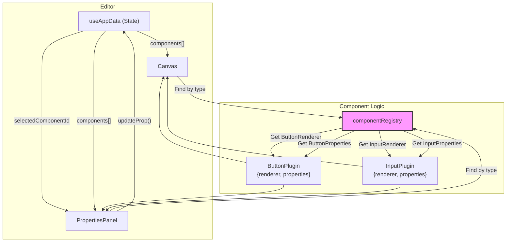

# Architecture Deep Dive: Component Architecture

This document outlines the pluggable component architecture, which is designed to make adding new, fully-featured UI components to the App Builder as simple as possible.

## 1. Goals and Requirements

-   **Extensibility**: Adding a new component should not require changing core editor files like `Canvas.tsx` or `PropertiesPanel.tsx`.
-   **Encapsulation**: All logic related to a specific component type—its rendering, its properties UI, and its default settings—should be co-located in a single plugin file.
-   **Standardization**: All components must adhere to a common interface (`ComponentPlugin`) so the editor knows how to interact with them.
-   **Decoupling**: The rendering logic (`renderer`) should be separate from the properties editing logic (`properties`).

## 2. The `ComponentPlugin` Interface

The core of the system is the `ComponentPlugin` interface defined in `src/types.ts`. Every component in the builder is defined by an object that implements this interface.

```typescript
// From: src/types.ts

export interface ComponentPlugin {
  // A unique identifier from the ComponentType enum.
  type: ComponentType;

  // Defines how the component appears in the left-hand palette.
  paletteConfig: {
    label: string; // e.g., "Text Input"
    icon: React.ReactNode; // SVG icon
    defaultProps: Record<string, any>; // Initial props for a new instance
  };
  
  // A React component that renders the component on the canvas.
  renderer: React.FC<any>;

  // A React component that renders the UI in the right-hand Properties Panel.
  properties: React.FC<any>;

  // Optional: If true, other components can be dropped inside this one.
  isContainer?: boolean;
}
```

## 3. The `componentRegistry`

The registry, located at `src/components/component-registry/registry.ts`, is a simple object that maps a `ComponentType` enum to its corresponding `ComponentPlugin` implementation.

```typescript
// From: src/components/component-registry/registry.ts

import { ComponentType, ComponentPlugin } from '../../types';
import { ButtonPlugin } from './Button';
import { InputPlugin } from './Input';
// ... other imports

export const componentRegistry: Record<ComponentType, ComponentPlugin> = {
    [ComponentType.BUTTON]: ButtonPlugin,
    [ComponentType.INPUT]: InputPlugin,
    // ... other component plugins
};
```
This registry acts as a central directory that the rest of the application uses to look up the correct renderer and properties UI for any given component.

## 4. How It Works: Rendering and Interaction Flow

### Rendering on the Canvas

1.  The `Canvas` component receives the list of components for the current page. It filters for root-level components (those with no `parentId`) and maps over them.
2.  For each component, it renders a `RenderedComponent` wrapper.
3.  The `RenderedComponent` wrapper is responsible for handling generic editor interactions: selection highlighting, drag-and-drop, resizing, and the delete button.
4.  Crucially, `RenderedComponent` looks up the component's plugin in the `componentRegistry` using its `type`.
    ```typescript
    // Simplified from: src/components/RenderedComponent.tsx
    const plugin = componentRegistry[component.type];
    const ComponentRenderer = plugin.renderer;
    // ...
    return <ComponentRenderer {...props} />;
    ```
5.  It then renders the specific `renderer` provided by the plugin, passing down all necessary props like `component`, `mode`, `evaluationScope`, `actions`, etc.
6.  If a component is a container (`isContainer: true`), its `renderer` will also render its `children`, which are recursively rendered `RenderedComponent` instances.

### Editing in the Properties Panel

1.  When a user clicks on a component, its ID is stored in the `selectedComponentId` state.
2.  The `PropertiesPanel` component receives this ID. It finds the full component object from the application's component list.
3.  Just like the canvas, it uses the component's `type` to look up its plugin in the `componentRegistry`.
    ```typescript
    // Simplified from: src/components/PropertiesPanel.tsx
    const plugin = component ? componentRegistry[component.type] : null;
    const PropertiesRenderer = plugin?.properties;
    // ...
    return <PropertiesRenderer {...props} />;
    ```
4.  It then renders the specific `properties` component provided by the plugin.
5.  The `PropertiesPanel` passes down the `component` data and an `updateProp` callback function. The `properties` component uses this callback to inform `useAppData` of any changes the user makes.

### Diagram: Component Data Flow

This diagram illustrates how the `componentRegistry` decouples the core editor from the specific component implementations.



## 5. How to Add a New Component (Example)

Creating a new component plugin is the primary way to extend the builder's functionality.

1.  **Define Types (`types.ts`)**: Add a new `ComponentType` enum, create a `YourComponentProps` interface, and add it to the `ComponentProps` union type.
2.  **Create Plugin File (`/component-registry/YourComponent.tsx`)**:
    *   **Create the Renderer**: A React component that visually represents your component on the canvas. It will receive props to handle dynamic values and user interactions in preview mode.
    *   **Create the Properties UI**: A React component that renders the form in the Properties Panel. Use the shared components from `common.tsx` (`PropInput`, `PropSelect`, etc.) and call the `updateProp` callback `onChange`.
    *   **Define the Plugin Object**: Create the `YourComponentPlugin` object, linking your `type`, `paletteConfig` (with an icon and default props), `renderer`, and `properties` components.
3.  **Register the Plugin (`/component-registry/registry.ts`)**: Import your new plugin and add it to the `componentRegistry` object.

Your component is now fully integrated and ready to be used.
